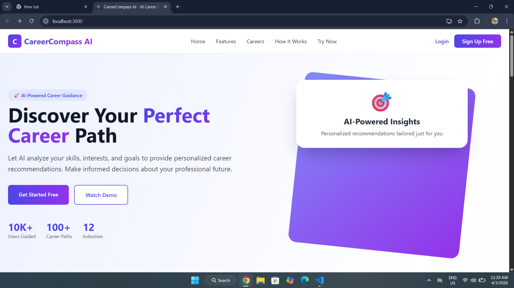
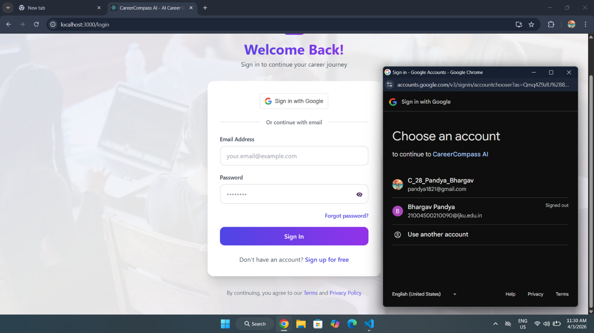
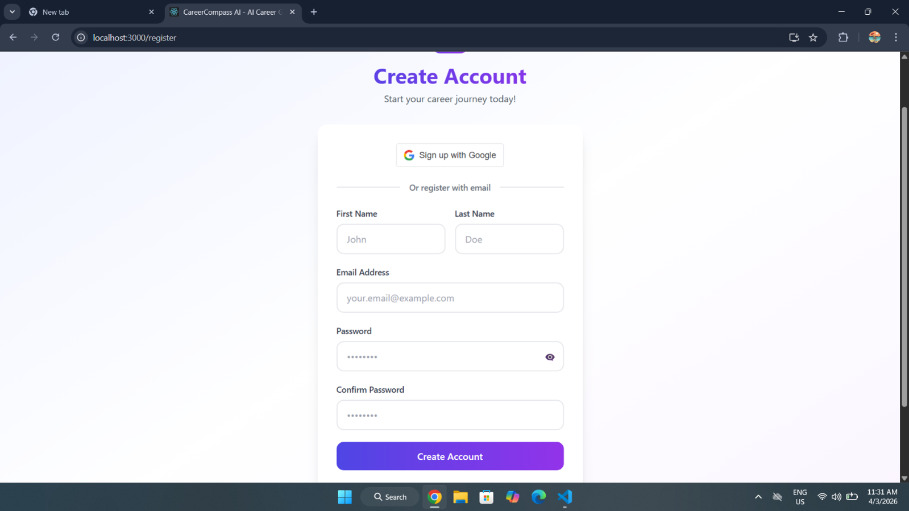
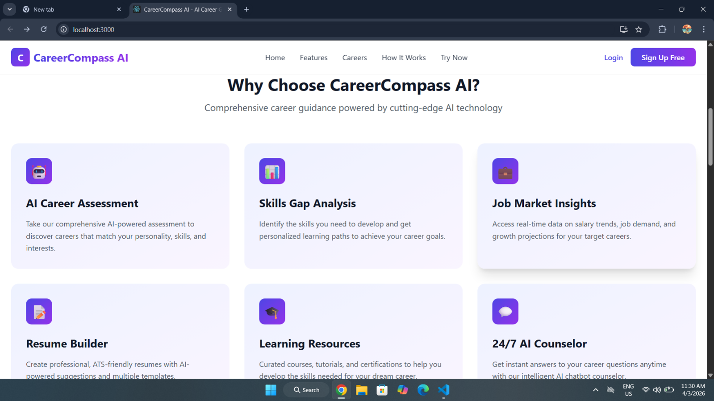
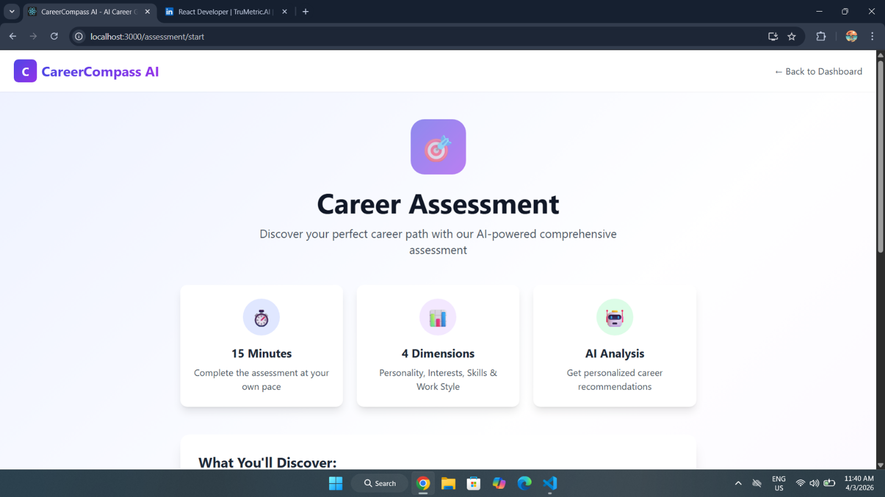
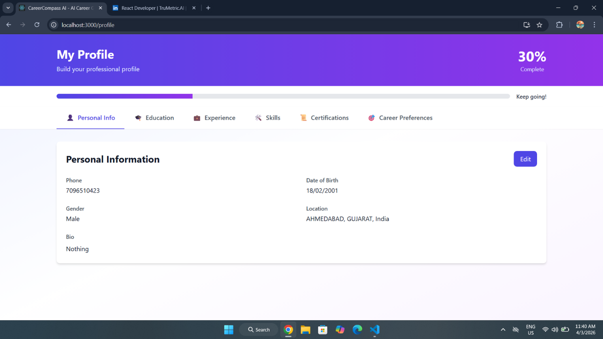
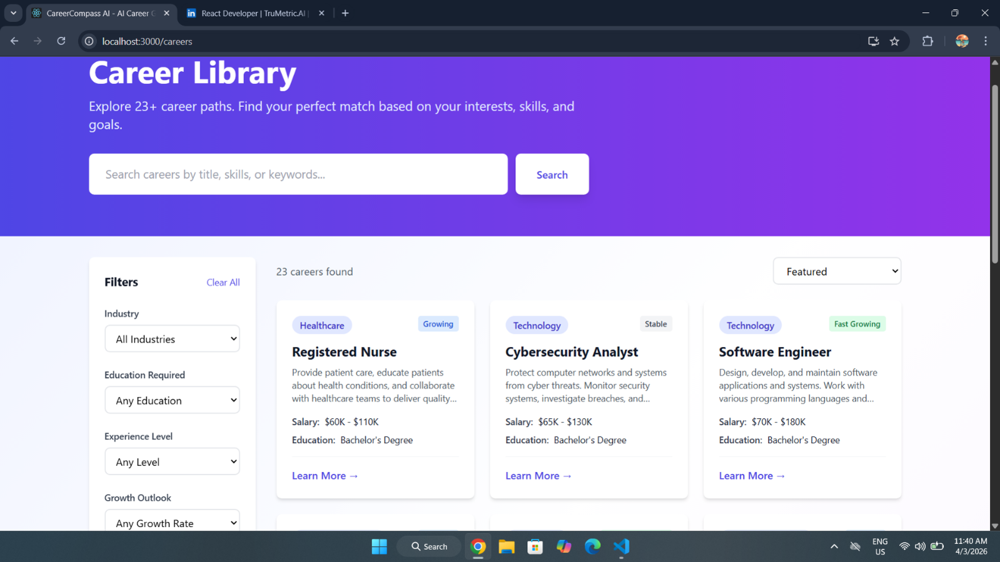
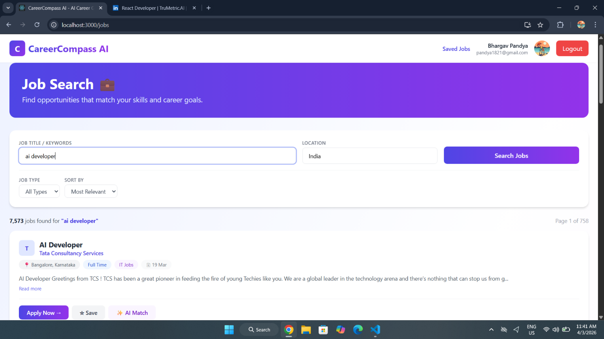
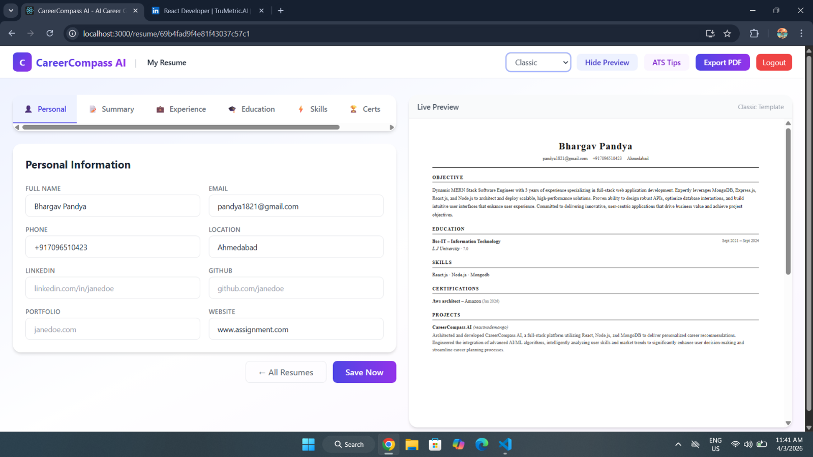

<div align="center">

# 🚀 CareerCompass AI

### AI-Powered Career Guidance Platform

Discover careers • Build ATS-friendly resumes • Search live jobs • Generate personalized learning roadmaps

---


</div>

---

# 📌 Project Highlights

| Feature | Details |
|----------|---------|
| 🤖 AI Model | Google Gemini 2.5 Flash |
| 🧠 Career Assessment | 40 Questions |
| 📄 Resume Templates | 4 Professional Templates |
| 💼 Live Job Search | Adzuna API |
| 📚 Career Library | 25+ Career Profiles |
| 📈 Learning Roadmap | AI Generated |
| 🔐 Authentication | JWT + Google OAuth |
| 🛠 Tech Stack | MERN Stack |

## 🌟 Overview

Choosing the right career can be confusing due to the vast number of career options, rapidly changing industry demands, and lack of personalized guidance.

CareerCompass AI solves this problem by combining Artificial Intelligence with modern web technologies to provide personalized career guidance based on a user's interests, skills, personality, and goals.

The platform allows users to:

- 🧠 Take an AI-powered career assessment
- 🎯 Receive personalized career recommendations
- 📚 Explore an extensive career library
- 👤 Build a complete professional profile
- 📄 Create ATS-friendly resumes with AI assistance
- 💼 Search live jobs using the Adzuna API
- 📈 Track job applications
- 🛣 Generate personalized learning roadmaps
- 🤖 Interact with an AI Career Counselor powered by Google Gemini

---

## ✨ Key Features

- 🔐 Secure Authentication (JWT + Google OAuth)
- 📧 Email Verification & Password Reset
- 🧠 AI Career Assessment
- 🤖 Google Gemini AI Integration
- 📄 AI Resume Builder
- 📊 ATS Resume Score
- 💼 Live Job Search
- ❤️ Saved Jobs
- 📈 Job Application Tracker
- 🎯 AI Match Score
- 📚 Career Library
- 🛣 Learning Path Generator
- 👤 Profile Completion Tracking
- 📱 Responsive Design

---

# 🛠 Tech Stack

## Frontend

- React.js
- React Router v7
- Tailwind CSS
- Axios

## Backend

- Node.js
- Express.js
- MongoDB
- Mongoose

## Authentication

- JWT Authentication
- Google OAuth 2.0
- Nodemailer (OTP Email Verification)

## Artificial Intelligence

- Google Gemini 2.5 Flash API

## External APIs

- Adzuna Jobs API

## Other Tools

- Git & GitHub
- VS Code
- Postman

---

# 🏗 System Architecture

```
                 React.js Frontend
                         │
                         │ REST API
                         ▼
               Express.js Backend Server
                         │
        ┌────────────────┼────────────────┐
        │                │                │
        ▼                ▼                ▼
   MongoDB          Gemini AI       Adzuna API
(Database)      (Career AI)       (Live Jobs)

```

---

# 📂 Project Structure

```
career-compass-ai/
│
├── backend/
│   ├── config/
│   ├── controllers/
│   ├── middleware/
│   ├── models/
│   ├── routes/
│   ├── data/
│   ├── scripts/
│   ├── utils/
│   └── server.js
│
├── frontend/
│   ├── public/
│   ├── src/
│   │   ├── components/
│   │   ├── context/
│   │   ├── pages/
│   │   └── App.js
│   │
│   └── package.json
│
├── assets/
│   └── screenshots/
│
├── .gitignore
└── README.md
```

---

# 🚀 Core Modules

### 🔐 Authentication

- JWT Authentication
- Google OAuth
- Email Verification
- Forgot Password
- Reset Password

---

### 🧠 Career Assessment

- 40-question assessment
- RIASEC & MBTI inspired evaluation
- AI-powered personality analysis
- Top career recommendations

---

### 📚 Career Library

- Search careers
- Filter by category
- Detailed career information
- AI Career Counselor

---

### 👤 Profile Builder

- Personal Information
- Education
- Experience
- Skills
- Certifications
- Career Preferences
- Profile Completion Score

---

### 📄 Resume Builder

- Multiple Resume Templates
- AI Resume Enhancement
- ATS Score Analysis
- Live Preview
- PDF Export

---

### 💼 Job Search

- Live Jobs via Adzuna
- Save Jobs
- AI Match Score
- Application Tracker
- Job Status Management

---

### 📈 Learning Path Generator

- Personalized AI Roadmap
- Courses
- Certifications
- YouTube Resources
- Progress Tracking

---

# 📸 Project Screenshots

## 🏠 Landing Page



---

## 🔐 Authentication

### Login



### Register



---

## 📊 Dashboard



---

## 🧠 Career Assessment



---

## 👤 Profile Builder



---

## 📚 Career Library



---

## 💼 Live Job Search



---

## 📄 AI Resume Builder



---

# 🤖 AI Features

CareerCompass AI leverages **Google Gemini 2.5 Flash** to deliver intelligent and personalized career guidance throughout the platform.

### AI Career Assessment

- Personality analysis
- Career matching
- Strength identification
- Personalized recommendations

### AI Resume Assistant

- Professional summary generation
- Experience enhancement
- Project description improvement
- Resume optimization

### AI Career Counselor

- Career-related Q&A
- Skill recommendations
- Career guidance
- Technology suggestions

### AI Learning Path Generator

- Personalized roadmap generation
- Recommended courses
- Certifications
- Learning resources

---

# 🌐 API Integrations

| API | Purpose |
|------|---------|
| Google Gemini 2.5 Flash | AI Career Guidance |
| Adzuna API | Live Job Listings |
| Google OAuth | Social Login |
| Nodemailer | Email Verification & OTP |

---

# ⚙️ Installation Guide

## 1️⃣ Clone the Repository

```bash
git clone https://github.com/bhargav180203/career-compass-ai.git
```

## 2️⃣ Navigate to the Project

```bash
cd career-compass-ai
```

## 3️⃣ Install Backend Dependencies

```bash
cd backend
npm install
```

## 4️⃣ Install Frontend Dependencies

```bash
cd ../frontend
npm install
```

## 5️⃣ Configure Environment Variables

Create a `.env` file inside the `backend` folder using the example below.

## 6️⃣ Start the Backend

```bash
cd backend
npm run dev
```

## 7️⃣ Start the Frontend

```bash
cd frontend
npm start
```

The application should now be available at:

```
http://localhost:3000
```

---

# 🔑 Environment Variables

Create a file named:

```
backend/.env
```

Example:

```env
PORT=5000

MONGO_URI=your_mongodb_connection_string

JWT_SECRET=your_jwt_secret

GEMINI_API_KEY=your_gemini_api_key

GOOGLE_CLIENT_ID=your_google_client_id

EMAIL_USER=your_email

EMAIL_PASS=your_email_password

ADZUNA_APP_ID=your_adzuna_app_id

ADZUNA_APP_KEY=your_adzuna_app_key
```

> ⚠️ Never commit your `.env` file to GitHub.

---

# 🚀 Future Enhancements

- 👨‍💼 Admin Dashboard
- 🤖 AI Mock Interview Module
- 📈 Skill Gap Analysis
- 🔔 Job & Learning Notifications
- 📱 Progressive Web App (PWA)
- 🌍 Multi-language Support
- 📅 Interview Scheduler

---

# 👨‍💻 Author

**Bhargav Pandya**

M.Sc. Information Technology

Full Stack Developer (MERN)

Ahmedabad, Gujarat, India

---

# ⭐ If you like this project

Please consider giving this repository a ⭐ on GitHub.

It helps support the project and encourages future development.